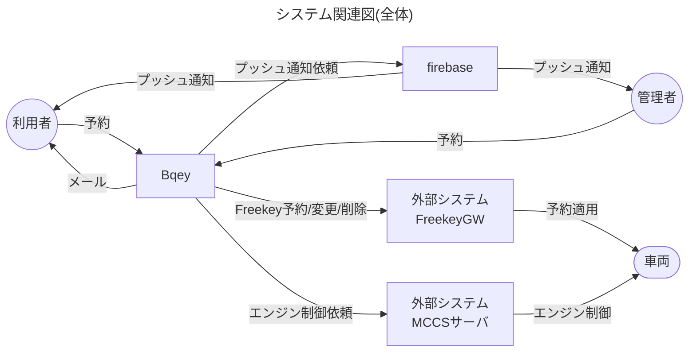
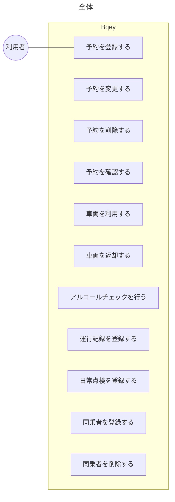

# ドメインモデリングについて

DDDにおいて、機能性を高めるための手法  
ビジネスサイドと協力して作成する  
モデリング手法として有名なものに次のようなものがあるらしい

- sudoモデリング、
- Event Storming
- リレーションシップ駆動要件分析(RDRA)
- ユースケース駆動分析設計(ICONIX)

## sudoモデリング

最低4つのモデル図を作成する

- システム関連図(s): 開発するシステムと関連するアクターや外部システムとの関係を示す 検索してもあまり出てこない。
- ユースケース図(u): ユーザーがシステムを通じて行えるアクションを表現します
- ドメインモデル図(d): ユビキタス言語を使用し、ドメインの概念やその関係を表現します
- オブジェクト図(o): ドメインモデルの具体例を示し、属性や関連、ルール/制約を記述します

次の2つを必要に応じて追加する

- 状態遷移図
- ER図

実践のポイント

- ユースケース記述を作成し、ユビキタス言語を抽出する
- ドメインモデル図では、属性を記入し、関連性を線で表現する
- オブジェクト図では、具体的な例を用いてドメインモデルを表現する
- 吹き出しを使用して、仕様やビジネスロジックを記述する

試しに予約機能を参考にmermaidで図を作成してみる

### 感想

ユースケース図からオブジェクト図&ドメインモデル図に持っていくのがきつい。
ユースケースを見ただけで、どんな感じの処理にするのかがわかるわけがない。

### システム関連図(s)

### ユースケース図(u)

