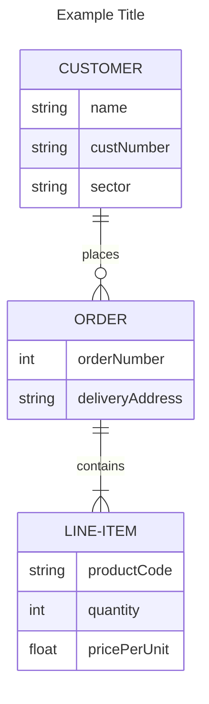
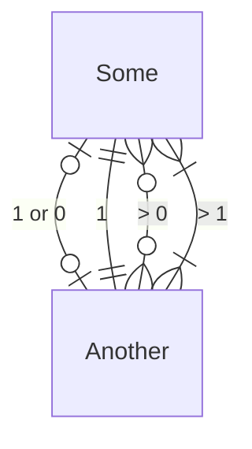

# [Mermaid記法](https://mermaid.js.org/)

コードで図を表現できる記法  
GitHubがデフォルトで採用しているので、README.mdなどに使用できる

## 表現可能な図

- フローチャート図
- シークエンス図
- クラス図
- 状態遷移図
- ER図
など

### ER図

サンプル

#### カーディナリティ

- `|o`: 1か0
- `||`: 1
- `}o`: 0以上
- `}|`: 1以上

## vscode拡張機能

- Markdown Preview Mermaid Support: Markdownのプレビューで表示するためのもの
- Mermaid Markdown Syntax Highlighting: シンタックスハイライト用
